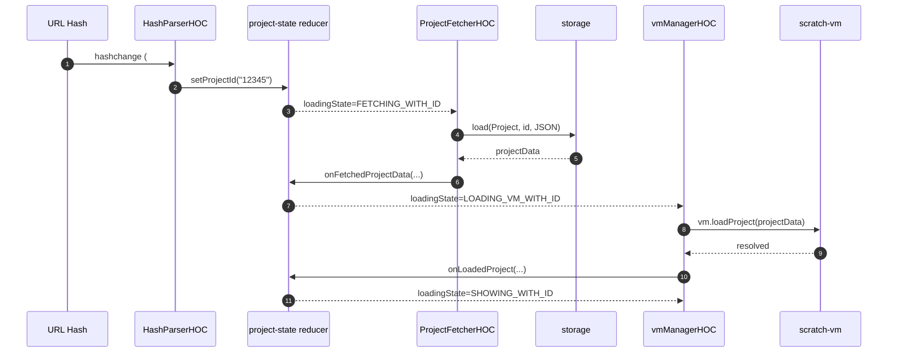
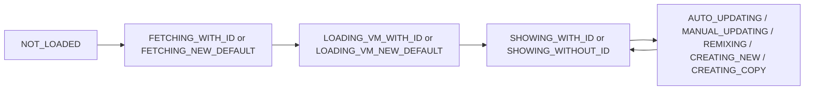
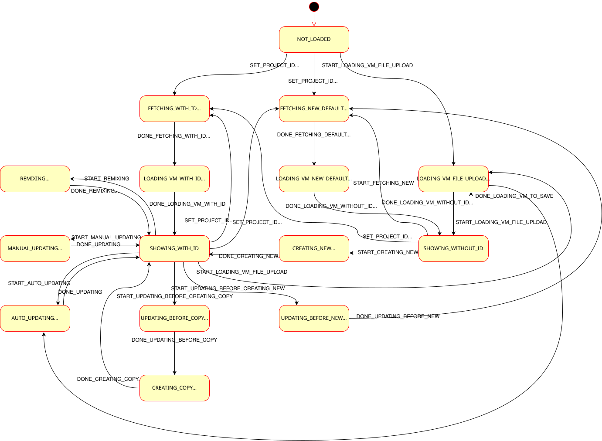
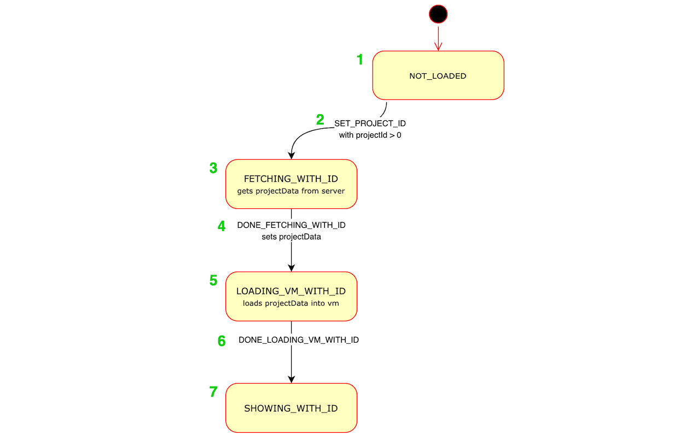
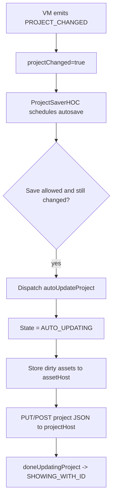
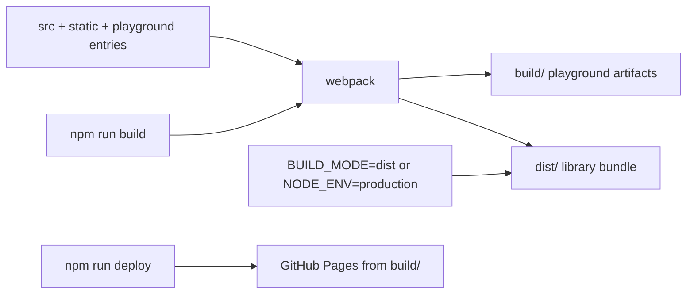

# LogicBoxWeb

LogicBoxWeb is a web editor/player based on `scratch-gui` with custom runtime, storage, and Blockly patches.

This README focuses on:
- How to set up and run the project.
- How the main parts work together.
- Where to look when you need to change behavior.

## Prerequisites

- Node.js `v20` (`.nvmrc`)
- npm (comes with Node.js)
- Git
- Chrome/Chromium + Chromedriver (for integration tests)

## Setup

```bash
git clone <your-repo-url>
cd LogicBoxWeb
nvm use 20   # optional, if you use nvm
npm install
npm start
```

Open:
- Main playground: `http://localhost:8601/`
- Blocks-only: `http://localhost:8601/blocks-only.html`
- Player: `http://localhost:8601/player.html`
- Compatibility testing: `http://localhost:8601/compatibility-testing.html`

## Scripts

- `npm start`: start webpack dev server.
- `npm run build`: build playground assets into `build/`.
- `npm run watch`: rebuild on file changes.
- `npm test`: lint + unit + build + integration.
- `npm run test:unit`: run unit tests only.
- `npm run test:integration`: run browser integration tests.
- `npm run test:smoke`: run smoke tests.
- `npm run deploy`: publish `build/` to GitHub Pages.

## Environment Variables

- `PORT`: dev server port (default `8601`).
- `BUILD_MODE=dist`: also build library output in `dist/` (besides `build/`).
- `NODE_ENV=production`: production build behavior.
- `DEBUG`: enable debug compile flag.
- `GA_ID`: Google Analytics id injected at build time.
- `GTM_ID`: Google Tag Manager id injected at build time.
- `GTM_ENV_AUTH`: GTM environment auth string.

## Project Layout

```text
src/
  components/     Presentational React components
  containers/     Connected container components (GUI entry lives here)
  lib/            HOCs, storage, cloud provider, utilities
  reducers/       Redux state slices and project state machine
  playground/     Browser entry points (index, player, blocks-only)
test/
  unit/           Unit tests
  integration/    Browser-level integration tests
  smoke/          Smoke tests
docs/
  project_state_diagram.svg
  project_state_example.png
patches/
  close_button.js
  close.svg
```

## Runtime Architecture

### 1) Bootstrap Path

`src/playground/index.jsx` decides if the browser is supported, then renders the main GUI through `render-gui.jsx`.

```mermaid
flowchart TD
    A[Browser loads playground entry] --> B[src/playground/index.jsx]
    B --> C{supportedBrowser()?}
    C -->|yes| D[src/playground/render-gui.jsx]
    C -->|no| E[Browser modal with locales-only store]
    D --> F[WrappedGui = AppStateHOC(HashParserHOC(GUI))]
    F --> G[GUI container + HOC stack]
```

### 2) GUI HOC Stack (Behavior Pipeline)

`src/containers/gui.jsx` composes behavior in this order:

```text
LocalizationHOC
-> ErrorBoundaryHOC
-> FontLoaderHOC
-> QueryParserHOC
-> ProjectFetcherHOC
-> TitledHOC
-> ProjectSaverHOC
-> vmListenerHOC
-> vmManagerHOC
-> SBFileUploaderHOC
-> cloudManagerHOC
-> systemPreferencesHOC
-> ConnectedGUI
```

Each HOC handles a focused concern:
- Loading locale/messages.
- Catching rendering/runtime errors.
- Parsing URL query/hash values.
- Fetching project JSON from project storage.
- Syncing VM events to Redux.
- Saving/autosaving/remixing/copying.
- Uploading `.sb/.sb2/.sb3` files.
- Connecting/disconnecting cloud data.

### 3) Core State Model

Redux state is rooted in:
- `locales`
- `scratchGui`
- `scratchPaint`

Inside `scratchGui`, `projectState` is the main finite state machine for load/save lifecycle (`src/reducers/project-state.js`).

## How Project Loading Works

Typical flow for URL `#<projectId>`:



Main state transitions:



Existing project-state docs:
- 
- 

## How Saving and Uploading Work

### Save / Autosave

`ProjectSaverHOC` watches `projectChanged` and triggers autosave when allowed.



### File Upload

`SBFileUploaderHOC` handles local file selection and VM load:
- Creates hidden `<input type="file">`.
- Reads selected file with `FileReader`.
- Calls `vm.loadProject(arrayBuffer)`.
- Updates `projectState` and title.

## VM and Cloud Data

- VM instance is created in `src/reducers/vm.js` and stored in Redux.
- `vmListenerHOC` subscribes to VM runtime events (`targetsUpdate`, monitors, turbo, running state, project changed).
- `cloudManagerHOC` connects to cloud only when:
  - `cloudHost`, `username`, `projectId`, permissions are available.
  - Project is in showing-with-id state.
  - Runtime has cloud data and no restricted extension conflict.

## Build and Deployment Model



Notes:
- Default `npm run build` focuses on `build/`.
- `dist/` is produced when `BUILD_MODE=dist` (or production mode).

## Project-Specific Customizations

### Postinstall patching of `scratch-blocks`

`scripts/patch-scratch-blocks.js` runs after `npm install` and:
- Copies `patches/close_button.js` and `patches/close.svg` into `node_modules/scratch-blocks`.
- Patches `workspace_svg.js` to wire a close button into workspace lifecycle.
- Restores expected shim content if needed.

If workspace close-button behavior looks wrong, reinstall dependencies:

```bash
npx rimraf node_modules package-lock.json
npm install
```

### Storage fetch behavior override

`src/lib/storage.js` replaces default scratch-storage worker fetch tools with a direct `fetch`-based implementation (`SimpleFetchTool`) to avoid hanging promises in some environments.

## Testing Notes

- Unit tests: fast logic/component checks.
- Integration tests: need browser + driver and a build output.
- Run `npm run build` before `npm run test:integration`.
- Full pipeline (`npm test`) can be long because it runs lint, unit, build, and integration.

## Quick Troubleshooting

- Project loads but assets fail:
  - Check `assetHost` and `projectHost` props/config.
- Cloud variables not syncing:
  - Confirm `cloudHost`, user session, project id, and cloud permissions.
- Save fails:
  - Check API credentials/cookies and project host accessibility.
- Build works locally but not on deployment:
  - Ensure deployment points to `build/` output (see `vercel.json`).
